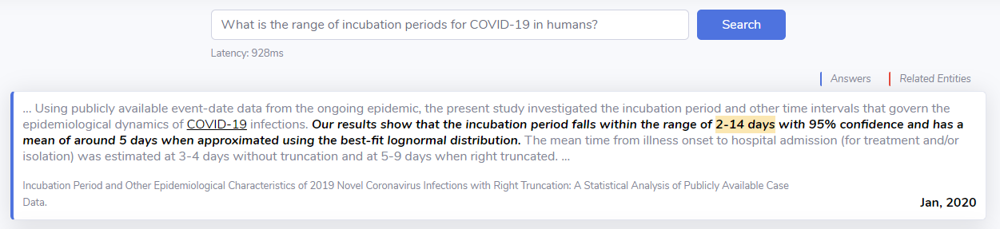

# <p align=center><i>covidAsk</i></p>
<p align="center"></p>
This repository provides code for covidAsk (https://covidask.korea.ac.kr), a real-time biomedical question answering system on COVID-19 articles. We currently support 1) dumping your own article set using our pre-trained models and 2) hosting a server like covidAsk on your machine. This project is done by the members of DMIS Lab at Korea University.

## Quick Start
With simple python requests, you can get answers from covidAsk.
```python
import requests
import json
from requests.packages.urllib3.exceptions import InsecureRequestWarning
requests.packages.urllib3.disable_warnings(InsecureRequestWarning)

def covidAsk(query):
    params = {'query': query, 'strat': 'dense_first'}
    res = requests.get('https://covidask.korea.ac.kr/api', params=params, verify=False)
    outs = json.loads(res.text)
    return outs

query = "Is there concrete evidence for the presence of asymptomatic transmissions?"
results = covidAsk(query)

# Top 10 phrase answers from covidAsk
print([r['answer'] for r in results['ret']])
```
The results will look like:
```bash
['little', 'lacking', 'no', 'evidence suggests the possibility of transmission from camel products or asymptomatic MERS cases', 'No', 'there is mixed', 'The research evidence is very lacking', 'there are a few', 'there are a few', 'There are few']
```
See `example.py` and our [Kaggle submission](https://www.kaggle.com/jinhyuklee/answering-domain-specific-questions-in-real-time) for more examples. To build your own covidAsk and host the system, See below.

## Environment
covidAsk is based on PyTorch and Faiss. You can install the environment with `environment.yml`.
```bash
$ conda env create -f environment.yml
$ conda activate covidAsk
```
Note that our code is mostly based on [DenSPI](https://github.com/uwnlp/denspi) and [DrQA](https://github.com/facebookresearch/DrQA).

## Download
We provide pre-processed CORD-19 datasets, pre-trained QA models, and their phrase dumps. Download required files from [here](https://drive.google.com/open?id=1ft6_EAU1XtcBeCLmwkGXhemewppOs_SO) and run `tar --xvzf datasets.tar.gz`. Or, you can run:
```bash
$ ./download.sh
```
Note that this script will not work if multiple users are downloading the file at the same time. This downloads all required resources (18GB) to your current directory. `data` directory has pre-processed datasets and evaluation dataset, `models` directory has pre-trained models, and `dumps` directory has phrase dumps obtained by the pre-trained models.

## Data
We previde two pre-processed versions of [CORD-19 abstracts](https://pages.semanticscholar.org/coronavirus-research) which will be used to make phrase dumps of DenSPI. We additionally extracted biomedical named entities using a multitask version of [BERN](https://bern.korea.ac.kr) and linked them into Concept Unique IDs using BioSyn (Sung et al., ACL 2020; will be open-sourced soon). Note that the format of pre-processed datasets is the same as SQuAD but with additional keys.
* Pre-processed 37k CORD-19 abstracts with extracted biomedical entities (`data/2020-04-10`) \[[link](https://drive.google.com/file/d/1tt-tgXjKIu5hH750rJvEbZDAiz1Tj5Rt/view?usp=sharing)\]
* Pre-processed 31k CORD-19 abstracts with extracted biomedical entities (2020-03-20 dump) \[[link](https://drive.google.com/file/d/1pyKJxGZgeLWknxMyOIGYAsOowZ6KlxHJ/view)\]
* 74 sample questions with annotated answers from Kaggle, CDC, and WHO (`data/eval`)

## Model
We use [DenSPI](https://www.aclweb.org/anthology/P19-1436/) as our base model for question answering. DenSPI supports a real-time question answering on a large unstructured corpus. To train your own DenSPI, see [here](https://github.com/uwnlp/denspi/). Our version of DenSPI is also trained with learnable sparse representations (Lee et al., ACL 2020; will be open-sourced soon). We provide two pretrained DenSPI as follows:
* DenSPI trained on SQuAD (`models/denspi`) - currently served at https://covidask.korea.ac.kr
* DenSPI trained on SQuAD + NaturalQuestions (`models/denspi-nq`)

`models/denspi` is more suitable for long, formal questions (e.g., Is there concrete evidence for the presence of asymptomatic transmissions?) and `models/denspi-nq` is good at short questions (e.g., covid-19 origin).

## Phrase Dump
We use the 2020-04-10 CORD-19 dataset for making the phrase dumps. We provide two phrase dumps obtained from the two models above.
* 2020-04-10 with DenSPI (SQuAD) - `dumps/denspi_2020-04-10`
* 2020-04-10 with DenSPI (SQuAD + NQ) - `dumps/denspi-nq_2020-04-10`

To make your own phrase dumps with different articles, run `create_dump.sh`. If you are going to use one of the provided phrase dumps above, you can skip this part and go to the Hosting section. Make sure that the paths for pre-trained DenSPI and pre-processed datasets are pointing the right directories.
```bash
$ ./create_dump.sh
```
This will create a new phrase dump under `dumps_new/$MODEL_$DATA`. Note that it will take approximately 1 hour when using `data/2020-04-10`. See log files in `logs/` to check if dumping is done. After the dumping, you need to run `create_index.sh` to make tfidf vectors of documents and paragraphs, and MIPS for phrase vectors.
```bash
$ ./create_index.sh
```
Before running, please change the directories in `create_index.sh` accordingly.

## Hosting
To serve your own covidAsk, use `serve.sh` script.
```bash
$ ./serve.sh
```
This will host a new server in localhost with the specified port (default `$PORT`: 9030). You will also need to serve query encoder (default `$Q_PORT`: 9010) and the metadata (default `$D_PORT`: 9020) at separate ports. Note that the model used for query encoding should be the same as the model that created the phrase dump. If you want to change the phrase dump to what you have created, change `$DUMP_DIR` to the new phrase dump (e.g., `DUMP_DIR=dumps_new/denspi_2020-04-10`) and `--doc_ranker_name` used in `d_serve` to `$DATA-tfidf-ngram=2-hash=16777216-tokenizer=simple.npz`. We also use biomedical entity search engine, [BEST](https://best.korea.ac.kr), to provide further information regarding the entities in the query.

Once you properly setup the server, you can ask questions with a simple python coding:
```python
from covidask import covidAsk

# Set $PORT
covidask = covidAsk(index_port='9030')

# Ask a question to covidAsk
query = "Is there concrete evidence for the presence of asymptomatic transmissions?"
result = covidask.query(query)
print([r['answer'] for r in result['ret']])
```
See `example.py` for more search options.

## Evaluation
We manually created a small evaluation set consisting of 74 questions regarding COVID-19 from Kaggle, CDC and WHO. Use `data/eval/kaggle_cdc_who_augmented.json` for the evaluation. You can make API calls to evaluate the server as:
```bash
$ python covidask.py --run_mode eval_request --index_port $PORT --test_path data/eval/kaggle_cdc_who_augmented.json
```
Or, you can evaluate by loading phrase dumps onto the memory as:
```bash
$ python covidask.py --run_mode eval_inmemory --query_port $Q_PORT --doc_port $D_PORT --dump_dir $DUMP_DIR --test_path data/eval/kaggle_cdc_who_augmented.json
```
This will save a prediction file into `pred/kaggle_cdc_who_augmented.pred` with results as follows:
```bash
04/17/2020 02:14:41 - INFO - __main__ -   {'exact_match_top1': 17.56756756756757, 'f1_score_top1': 26.885230840315774}
04/17/2020 02:14:41 - INFO - __main__ -   {'exact_match_top10': 25.675675675675677, 'f1_score_top10': 43.14339166481719}
```

## Reference
Technical report of our work will be arxived soon with following bibtex.
```
@article{lee2020covidask,
  title={Answering Domain-Specific Questions in Real-Time for COVID-19 Research},
  author={Lee, Jinhyuk and Jeong, Minbyul and Sung, Mujeen and Yoon, Wonjin and Sung, Mujeen and Choi, Yonghwa and Ko, Miyoung and Lee, Seok-Won and Kang, Jaewoo},
  journal={arxiv},
  year={2020}
}
```

## Contact
For any issues regarding covidAsk, please register a GitHub issue.
For any collaboration related to covidAsk, please contact Jinhyuk Lee (`lee.jnhk (at) gmail.com`).
